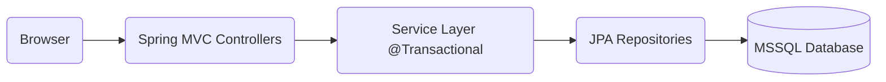
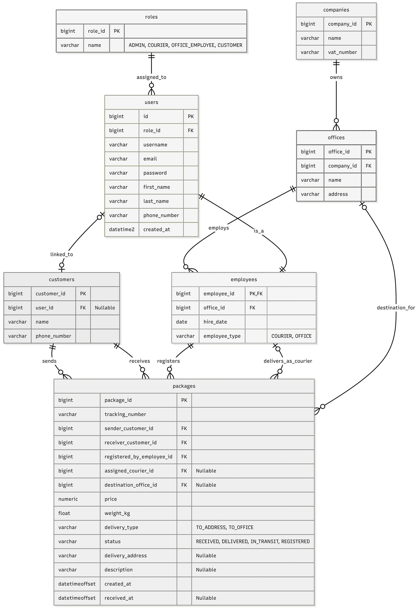

<div align="center">

# 📦 Logistics Company Management System


</div>

<div align="center">

The **Logistics Company System** is a full-stack Java application designed to automate the daily operations of a shipping company.<br> It facilitates the entire lifecycle of a package—from registration at an office to final delivery by a courier.

The system features a robust **Role-Based Access Control (RBAC)** model, ensuring that Administrators, Office Employees, Couriers,<br> and Clients have access to specific functionalities tailored to their responsibilities.

</div>

---

<div align="center">

## 📐 Architecture & Design
The system adheres to a strict **Separation of Concerns (SoC)** principle, ensuring maintainability and scalability:

</div>



---

<div align="center">


## 🗄️ Database Schema

The application uses a relational database model optimized for data integrity.



</div>

---

## 👥 Team Members & Contributions

The project was developed by a team of 4 students. Below is the breakdown of responsibilities:

| Student Name | Role / Focus Area | Key Contributions |
| :--- | :--- | :--- |
| **Plamen Kostov [F113851]** | **Backend Lead / Architecture** | • Database design & ER Diagram<br>• Spring Security Configuration<br>• Service Layer Logic (Pricing, Package flow)<br>• Client Dashboard Logic|
| **Ivan Ivanov [F115436]** | **Full Stack / Features** | • Full Controller implementation<br>• Data Seeder (Dummy data generation)<br>• Validation Logic (DTOs)<br>• Reporting Functionality (Queries)<br>• Extensive Front-end development<br> & UI/UX optimization across all modules |
| **Ilian Yanev [F115564]** | **Frontend / UI/UX** | • Thymeleaf Templates & Layouts<br>• CSS Styling & Responsive Design<br>• Interactive Map Integration (JS) |
| **Kaloyan Andrikov [F113853]** | **QA / Documentation** | • Unit Testing<br>• Documentation & README<br>• Login form UI |

---

## 🛠️ Tech Stack

* **Backend:** Java 17, Spring Boot 3 (Web, Data JPA, Security, Validation)
* **Database:** Microsoft SQL Server
* **Frontend:** Thymeleaf (Server-side rendering), HTML5, CSS3, JavaScript
* **Mapping:** Leaflet.js + OpenStreetMap (for office visualization)
* **Security:** Spring Security 6 (BCrypt password hashing, CSRF protection)
* **Build Tool:** Gradle

---

## 🌟 Key Features & Functionalities

### 🌍 Public Module (No Login Required)
* **Shipment Tracking:** Real-time package tracking using a unique Tracking Number (UUID). Displays a visual timeline of the package journey (Registered -> In Transit -> Delivered).
* **Office Locator:** Interactive map integration (Leaflet) showing all company office locations with markers.
* **Company Info:** Information about services and tariffs.

### 👤 Client Module
* **Personal Dashboard:** Overview of "My Packages" (both sent and incoming).
* **History:** Detailed history of past shipments.
* **Personal Details:** Manage contact information used for automated shipping forms.

### 🏢 Office Employee Module
* **Package Registration:** * Form to accept shipments.
    * **Automated Pricing:** Calculates shipping cost based on weight, delivery type (To Office / To Address), and sender/receiver details.
* **Client Management:** Search and manage client profiles.
* **Shipment Handover:** Mark incoming packages as "Received" or "In Transit".
* **Status Updates:** Update package statuses (e.g., from REGISTERED to IN_TRANSIT).

### 🚚 Courier Module
* **Delivery Dashboard:** View assigned packages pending delivery.
* **"Pick Up" System:** Browse unassigned (pending) packages and claim them for delivery.
* **Status Management:** Mark packages as DELIVERED upon successful handover.
* **Filtering:** Filter packages by neighborhood/address for efficient route planning.

### 🛡️ Admin Module
* **Employee Management:** Hire/Fire employees, assign roles (Courier/Office Employee), and assign base offices.
* **Office Management:** Create and manage physical office locations.
* **Advanced Reporting:** * **Financial Reports:** Calculate company income over a specific date range.
    * **Employee Performance:** Track packages registered/delivered by specific employees.
    * **Client Activity:** View shipment volume by client.

---

## 📸 Application Screens

### 1. Landing Page & Tracking
*The public face of the application where users can track shipments without logging in.*


### 2. Interactive Map (Offices)
*Integration with Leaflet API to visualize office locations.*


### 3. Client Dashboard
*User view showing active shipments and status timeline.*


### 4. Package Registration (Employee)
*The form used by employees to register new shipments and calculate prices.*


### 5. Admin Reports
*Financial and operational statistics.*


### 6. Employee Management
*Administrator-only interface for managing staff, assigning roles (Courier/Office Employee), and linking users to specific offices.*


### 7. Pending Shipments Monitoring
*A specialized view for Admins and Office Employees to monitor all active packages that are registered or in transit but not yet delivered.*


---

## 🚀 Installation & Setup

1.  **Clone the repository:**
    ```bash
    git clone [https://github.com/PKKostov18/logistics-company]
    ```

2.  **Configure Database:**
    Open `src/main/resources/application.properties` and update your MS SQL Server credentials:
    ```properties
    spring.datasource.url=jdbc:sqlserver://localhost:1433;databaseName=LogisticsCompany;encrypt=true;trustServerCertificate=true
    spring.datasource.username=${DB_USER}
    spring.datasource.password=${DB_PASSWORD}
    ```

3.  **Run the Application:**
    ```bash
    ./gradlew bootRun
    ```

4.  **Access:**
    Open `http://localhost:8080` in your browser.

---
